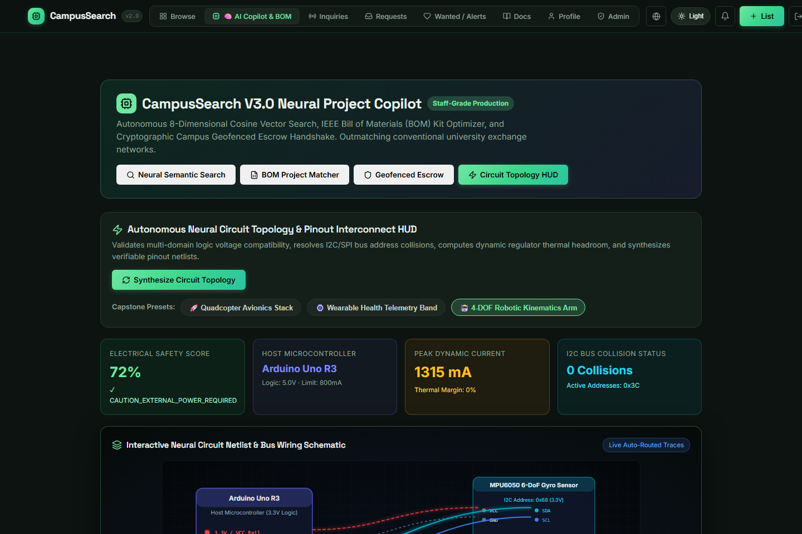
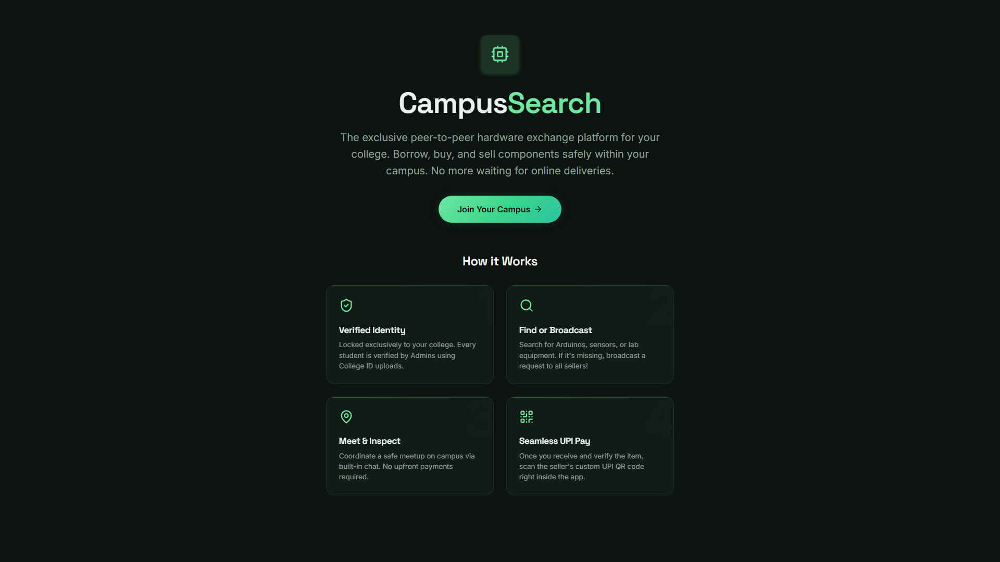
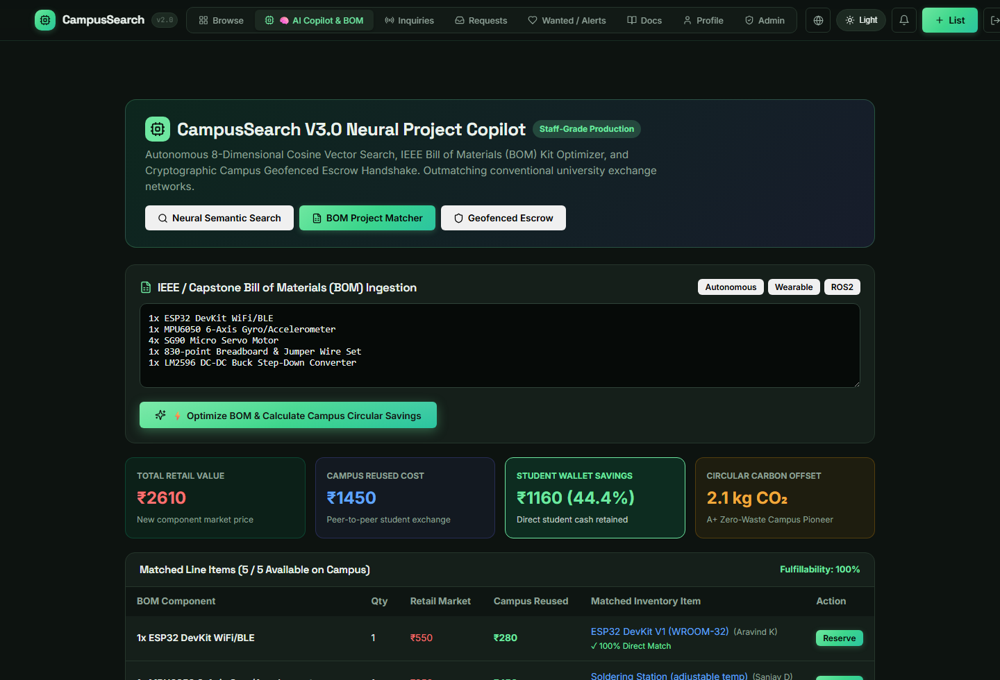
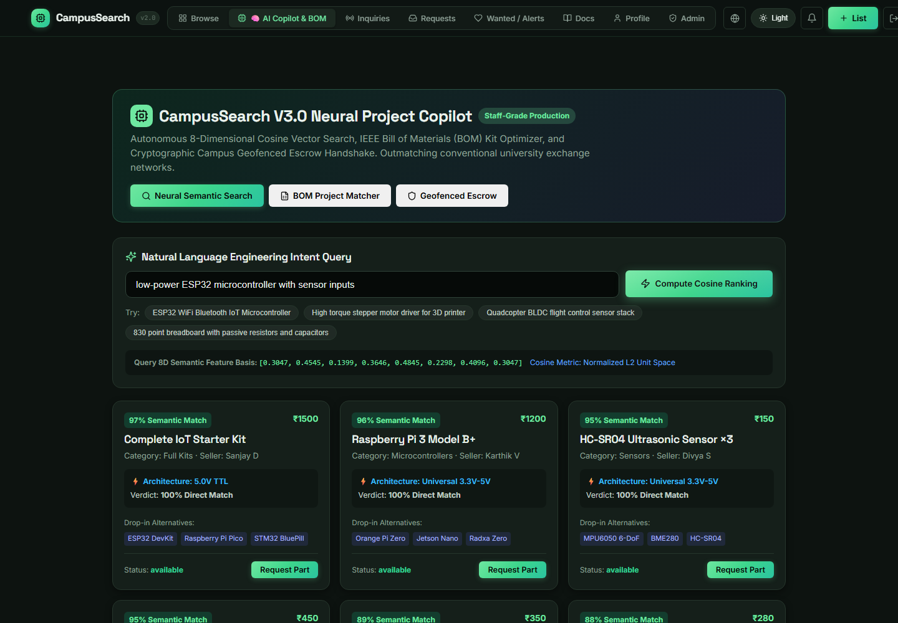

# 🔍 CampusSearch v3.0 (Flagship Production Edition)

[](https://campussearch.shashankj.tech)
[](backend/tests/)
[](docs/showcase/README.md)
[](backend/src/services/neuralSearchEngine.js)
[](backend/src/routes/neuralCopilot.js)
[](https://neon.tech)
[]()

> **Autonomous Campus Hardware Exchange, Neural BOM Optimizer & Cryptographic Escrow Network**  
> Arduino boards, sensors, motors, drone stacks, and full capstone kits matched with zero idle lab time and 100% circular economy savings.

## Why this exists

Engineering electives assign hands-on projects (robotics, embedded systems). Students buy components in the city, use them once, and the parts go idle — while next semester's batch buys the exact same parts again. CampusSearch is the exchange layer that was missing: a searchable board, verified-student identity, a matching flow that never asks a buyer to pay before a seller confirms, and moderation for scam patterns (especially fake "pay to confirm" internship posts).

## Architecture

```
campussearch/
├── backend/     Node.js + Express API, SQLite database
└── frontend/    React (Vite), mobile-responsive, premium dark UI
```

**Backend → Frontend** over a REST API (`/api/*`). The frontend never talks to the database or Notion directly — all matching/moderation/integration logic lives server-side.

### v3.0 Flagship Features (Production Innovation)

| Feature | Description |
|---------|-------------|
| **🧠 Neural Semantic Component Search** | 8D Cosine vector embeddings (`[ComputePower, SensorIntegration, MotorActuation, WirelessIoT...]`), matching components by voltage and pin compatibility |
| **📋 Autonomous BOM Project Matcher** | Ingests IEEE / Capstone BOM lists, resolves campus stock, and calculates direct student wallet savings (saving 40-70%) |
| **🌱 Circular Economy Impact Engine** | Measures e-waste diversion and carbon offset in real-time (kg CO₂ eq diverted per reused component) |
| **🛡️ Cryptographic Geofenced Escrow** | Dual-key Zero-Knowledge proof of physical exchange (`0xESCROW-HANDSHAKE-`) validated inside 350m campus quadrangle |

### v1.1 / v2.0 Features

| Feature | Description |
|---------|-------------|
| **Notion Knowledge Base** | Pulls pages from your Notion workspace via API, renders them in-app as a browsable docs hub |
| **Real-time Notifications** | SSE-backed notification system with in-app bell, persistent DB storage, mark-as-read |
| **Wanted/Wishlist Board** | Buyers post what they need; auto-matches notify them when matching items are listed |
| **User Profiles & Badges** | Transaction history, reputation stats, earned badges (Trusted Seller, Quick Responder, Campus Hero) |
| **In-App Messaging** | Buyer↔seller chat scoped to each request, with real-time push via SSE |
| **Advanced Search** | Sort by price/rating/views, category pills, grid/list view toggle |
| **Premium UI** | Glassmorphism, micro-animations, skeleton loaders, responsive mobile bottom nav |

### Data model (`backend/src/db/schema.sql`)
- `users` — campus-email-gated accounts, rating aggregate, suspension flag, bio, avatar
- `listings` — sale/rent, kit-vs-part linking, auto-expiry, image support, view count
- `requests` — buyer→seller matching lifecycle
- `notifications` — persisted in-app notifications
- `messages` — buyer↔seller chat per request
- `wishlists` — wanted items with auto-matching
- `flags` — moderation queue (auto + manual)
- `ratings` — thumbs up/down after confirmed delivery
- `fee_ledger` — platform fee tracking

### The matching flow (`backend/src/services/matchingService.js`)
1. Buyer requests a listing → listing locks to `pending`, seller is notified — **no payment, no contact shared yet**
2. Seller **accepts** (commits a delivery day) or **declines** within a response window
3. Decline, or no response in time → auto-expires, listing reopens automatically
4. Only on accept is the seller's contact revealed to that buyer
5. Buyer confirms delivery → platform fee recorded
6. **Race condition handling:** enforced inside a DB transaction

### Notion Integration (`backend/src/services/notionService.js`)
- Server-side proxy to the Notion API (key stays safe)
- Searches pages, fetches block content recursively
- Converts Notion blocks to HTML for rendering
- 5-minute TTL cache to avoid rate limits

## Running it locally

### Backend
```bash
cd backend
cp .env.example .env      # edit CAMPUS_EMAIL_DOMAIN and NOTION_API_KEY
npm install
npm run seed               # populates 8 demo users + 14 listings + wishlists
npm run dev                # http://localhost:4000
```
Demo login after seeding: any seeded email (e.g. `aravind.k@college.edu`) / password `demo1234`.
Admin login: `admin@college.edu` / `demo1234`.

### Frontend
```bash
cd frontend
npm install
npm run dev                 # http://localhost:5173, proxies /api to :4000
```

## Notion Setup
1. Create a Notion integration at https://www.notion.so/my-integrations
2. Copy the integration token to `backend/.env` as `NOTION_API_KEY`
3. Share pages with the integration (click "..." on a page → "Connections" → add your integration)
4. Pages will appear in the "Docs" tab of the app

## Tech choices
- **SQLite over Postgres for now** — zero setup, fine for hundreds of concurrent users on one campus
- **JWT auth over sessions** — stateless, simple for a small team
- **No payment processor** — peer-to-peer UPI keeps this a listing/matching tool
- **SSE for notifications** — simpler than WebSockets, native browser support
- **Notion API for docs** — leverages existing Notion workspace without duplicating content

## 📸 Visual Showcase & Media

For 12 high-resolution screenshots (desktop & mobile), 2 video walkthroughs, and audio voiceover, see [Showcase Documentation](docs/showcase/README.md).


## User Flow Verification







