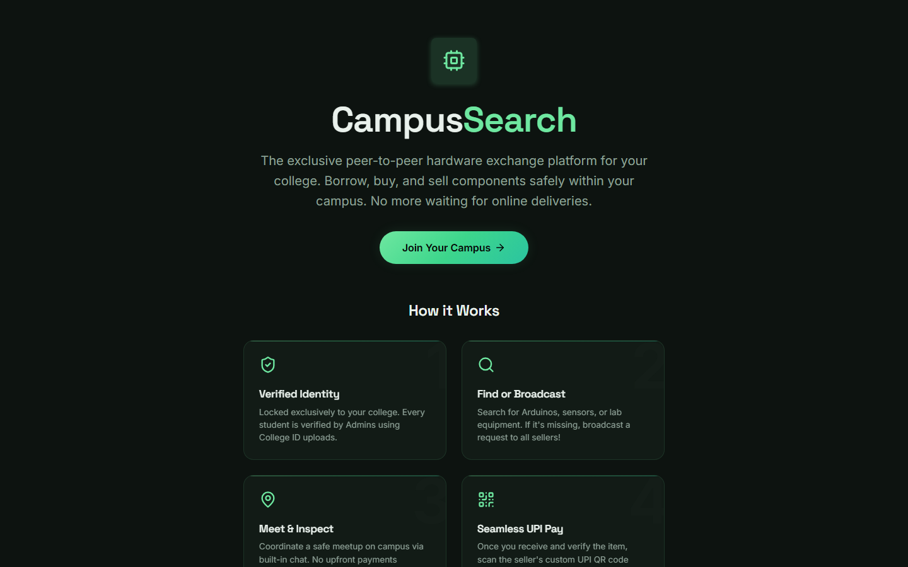
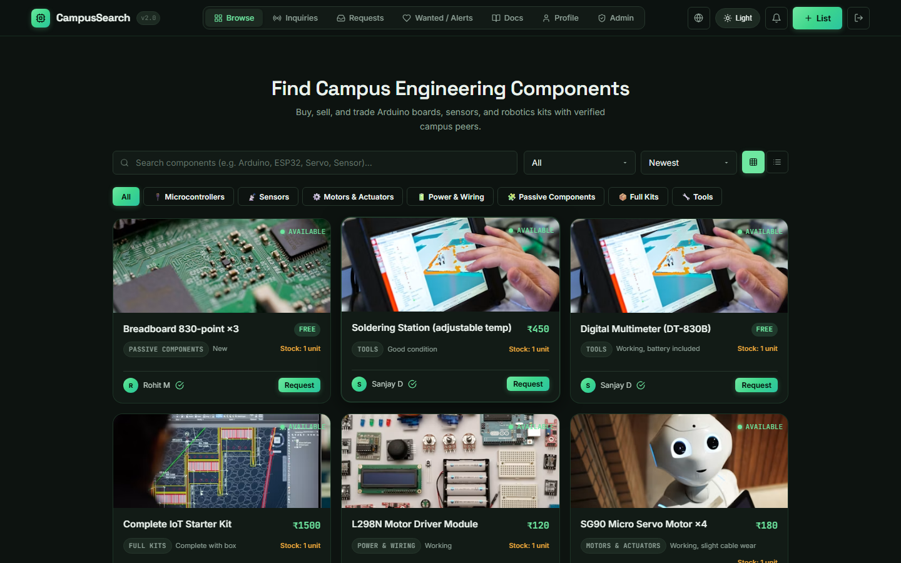
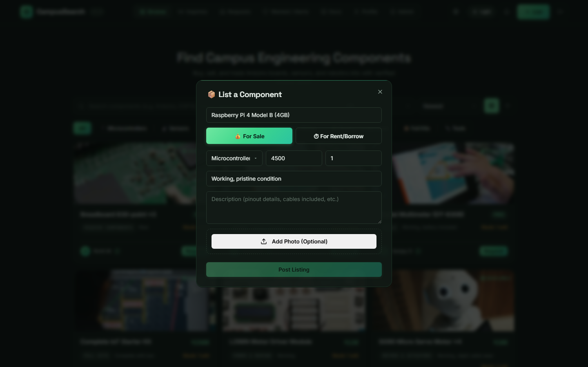
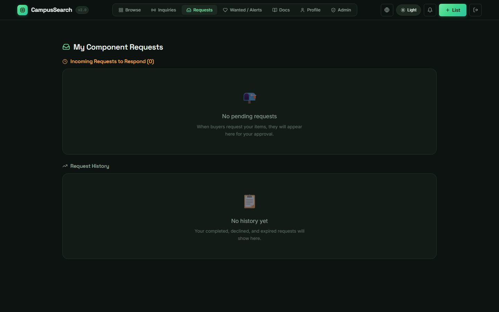
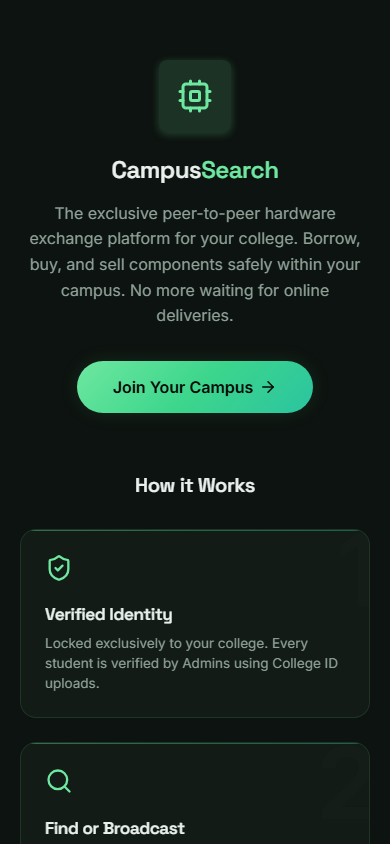
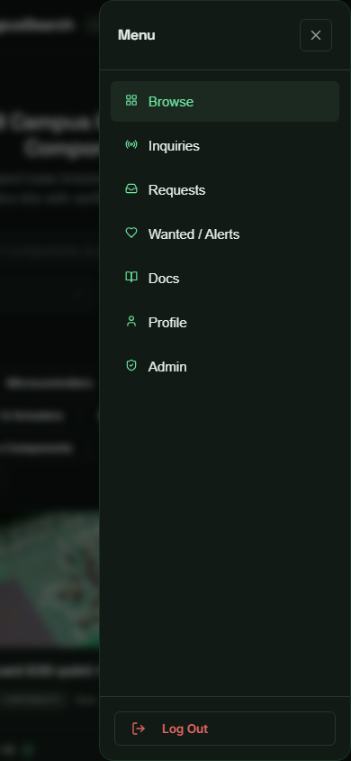
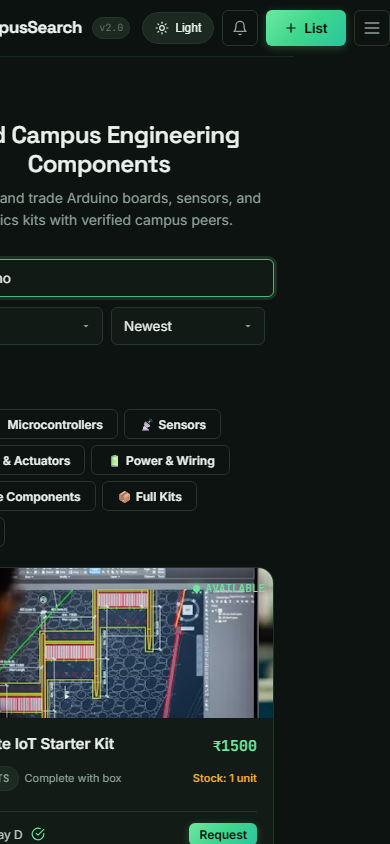
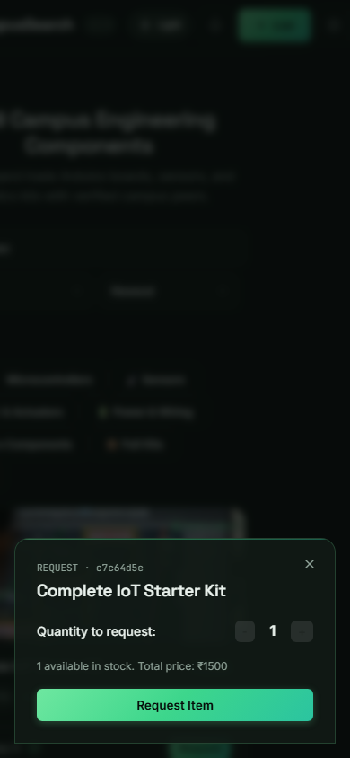
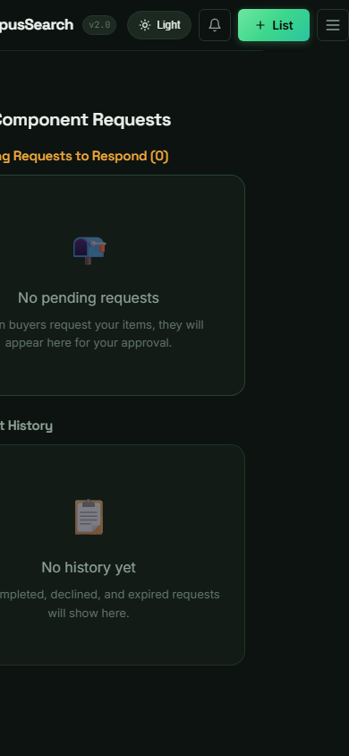

# 🔍 CampusSearch v1.1 (Production v2.0) — Showcase & Architecture

> **Campus-Restricted Reusable Engineering Hardware Marketplace**  
> Built to eliminate redundant semester-over-semester hardware component purchases across university engineering departments, featuring verified student identity, zero upfront payment escrow matching, real-time SSE notifications, and live Notion API docs integration.

---

## 🔗 Production Deployment
- **Live URL**: [https://campussearch.shashankj.tech](https://campussearch.shashankj.tech)
- **SSL / CDN**: Cloudflare + Vercel Edge CDN + Custom Domain
- **Backend API**: Node.js + Express on Cloud Postgres (Neon WAL v2.0)
- **PWA Status**: Service worker enabled with offline fallback manifest

---

## 🎬 Video Walkthroughs & Media
| Media | File Location | Description |
|---|---|---|
| **Mobile Video Walkthrough** | `videos/CampusSearch_Mobile_Walkthrough.webm` | Full portrait screen recording demonstrating navigation, search, listing modals, and inquiries feed. |
| **Phone Showcase** | `videos/CampusSearch_Phone_Showcase.mp4` | High-definition mobile recording showcasing responsive touch layouts. |
| **Voiceover Audio** | `videos/showcase_voiceover.mp3` | Professional narrative audio walkthrough of the platform vision and architecture. |

---

## 📸 Canonical Showcase Gallery

### 1. Desktop Experience (High-Resolution)
| Screen | Screenshot | Key Highlights |
|---|---|---|
| **Hero Landing** |  | High-contrast dark glassmorphism hero banner with instant CTA. |
| **Browse Catalog** |  | Category chips, price range sliders, search filter, and component grid. |
| **List Item Modal** |  | Hardware listing creation with condition grading, stock, and image upload. |
| **Requests Inbox** |  | Buyer/seller request dispatch manager with status indicators. |
| **Chat & Inquiries** |  | Contextual buyer-seller negotiation channel scoped per request. |
| **Broadcast Feed** |  | Real-time campus-wide availability inquiries and urgent component wants. |

### 2. Mobile Emulation (390 x 844 Responsive)
| Screen | Screenshot | Key Highlights |
|---|---|---|
| **Mobile Hero** |  | Zero viewport clipping, mobile-optimized typography and CTA button. |
| **Hamburger Menu** |  | Smooth overlay drawer providing access to all 7 platform sections. |
| **Mobile Catalog** |  | Touch-friendly component cards with badge tags and seller reputation. |
| **Request Modal** |  | Ergonomic touch inputs with quantity selectors and stock info. |
| **Requests Inbox** |  | Mobile-adapted card view for active component deliveries. |
| **Inquiries Feed** |  | Live stream of wanted hardware alerts across engineering batches. |

---

## 🔒 Security & Anti-Scam Architecture
1. **Verified Student Identity**: Mandatory USN (University Seat Number) validation and College ID verification workflow.
2. **Escrow Matching Flow**: Buyer contact info is strictly held until the seller formally accepts the handoff window.
3. **Zero Upfront Payment**: Blocks malicious "pay-to-confirm" advance payment scams.
4. **Stale Listing Sweeper**: Scheduled background sweeper automatically reopens lapsed requests and expires unfulfilled listings after 60 days.
